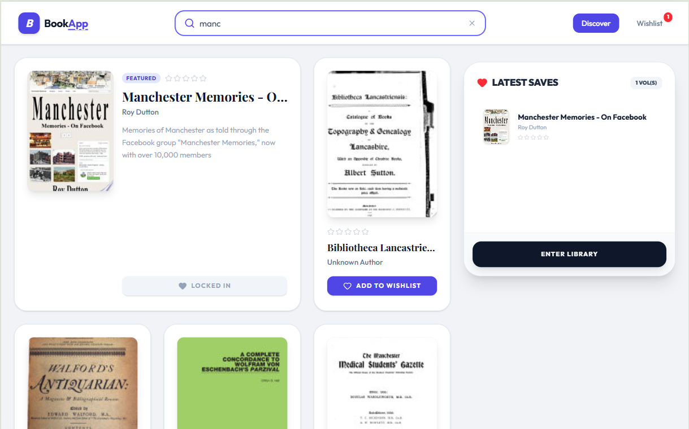
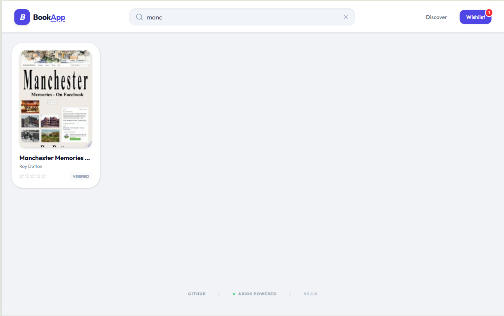

# BookApp Fullstack

## Structure

- frontend/
- backend/
- docker-compose.yml

## Run with Docker

**Dont forget to add env.example for backend and env.docker for frontend, please follow the env.example on both backend (env.example) and frontend (env.docker) to work**

```bash
docker compose up --build
```

Frontend:
http://localhost:5173

Backend:
http://localhost:5000

## Run Frontend Manually

```bash
cd frontend
npm install
npm run dev
```

## Run Backend Manually

```bash
cd backend
npm install
npm run dev
```

## Run Tests

### Frontend Tests

```bash
cd frontend
npm install
npm test
```

### Backend Tests

```bash
cd backend
npm install
npm test
```

### Run All Tests

```bash
cd frontend && npm test & cd ../backend && npm test
```

## Screenshots

### Mobile


### Desktop



